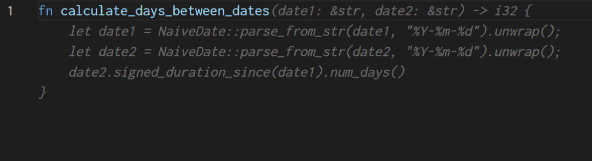

# Change Stepper

Step forwards and backwards through a large single change (insert or suggestion accept) or selection, by line and word. This is useful if you only want to use parts of a large suggestion by, for instance, [Github Copilot](https://github.com/features/copilot/).

## Features

After making a large change, like accepting a suggestion from Github Copilot, you can step forwards and backwards through the change by line or word using the following commands:

| Command | Default PC keyboard shortcut | Default Mac keyboard shortcut |
| ------- | ---------------------------- | ----------------------------- |
| `change-stepper.previousWord` | `ctrl+alt+H` | `cmd+alt+H` |
| `change-stepper.nextLine` | `ctrl+alt+J` | `cmd+alt+J` |
| `change-stepper.previousLine` | `ctrl+alt+K` | `cmd+alt+K` |
| `change-stepper.nextWord` | `ctrl+alt+L` | `cmd+alt+L` |

HJKL are the "arrow" keys in Vi, but you're free to use any keybindings you like. I personally swap J and K around.

If you start off by going backwards, you start from the end of the change. If you start off by going forwards, you start from the beginning of the change.



You can also select some text, and initiate the stepping with any of the commands to step through the selection.

## Extension Settings

Currently the only settings are the keybindings. If you want to change them, you can do so in the Keyboard Shortcuts editor. Hit `ctrl+K ctrl+S` on PC or `cmd+K cmd+S` on Mac to open the Keyboard Shortcuts editor.

## Installation

You can install this extension:
 * from the [VSCode Marketplace](https://marketplace.visualstudio.com/items?itemName=drwilco.change-stepper).
 * through the Extensions tab in VSCode: `ctrl+shift+X`/`cmd+shift+X` and search for "Change Stepper".
 * from the command line:

    ```bash
    code --install-extension drwilco.change-stepper
    ```

## Known Issues

VSCode has built in support for stepping through suggestions, as of January 2023. This is better integrated, but it doesn't yet support stepping through by line, or even words beyond the first line. Once VSCode supports stepping through by line, this extension will probably be unnecessary.

## Release Notes

### 1.0.0

Initial release of Change Stepper
